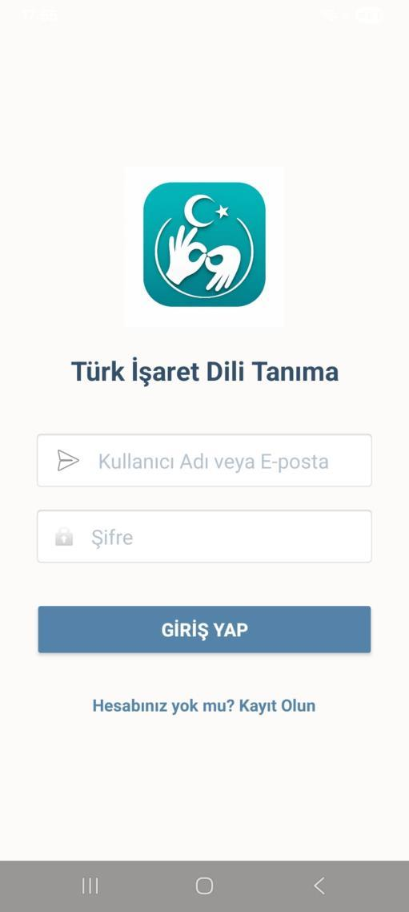
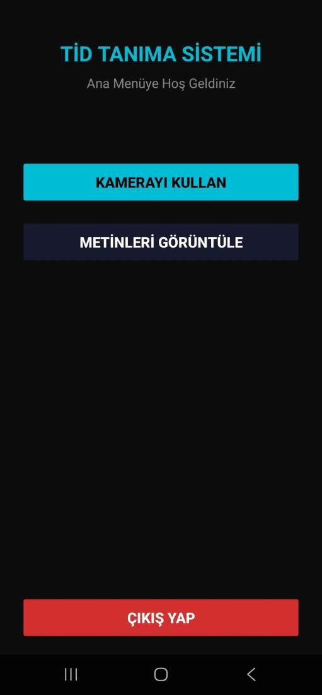

# Turkish Sign Language Recognition on Android (TİD)

> Real-time, fully on-device recognition of Turkish Sign Language letters, words and digits from the phone camera — MediaPipe hand landmarks + a small Keras MLP, deployed with TensorFlow Lite in a Kotlin/CameraX app.


Computer Engineering graduation project. The app recognizes a sign, shows it with its confidence score, and appends it to a text the user builds up sign by sign. Recognition runs entirely on the phone without an internet connection; Firebase is used only for sign-in and for backing up saved texts.

<p align="center">
  
  &nbsp;&nbsp;
  
</p>

---

## Results

| Model | Classes | Input | Test accuracy | Weighted F1 | TFLite size |
|---|---|---|---|---|---|
| Letters | 32 (29 Turkish letters + `del`, `space`, `nothing`) | 156 (2 hands) | **90.28%** | 90.27% | ~328 KB |
| Words | 20 common words | 78 (1 hand) | **99.5%** | 99.5% | ~127 KB |
| Digits | 11 (0–9 + `nothing`) | 78 (1 hand) | **98.3%** | 98.3% | ~126 KB |

- Feature extraction + inference + voting takes **~23 ms per frame** on the phone; the classifier itself runs in under 5 ms on the CPU.
- Per-class letter scores are in [`evaluation_summary.json`](turk_isaret_dili_proje/tid_pipeline/output/evaluation_summary.json) and the training curve is in [`letter_model_2hands_history.csv`](turk_isaret_dili_proje/tid_pipeline/output/letter_model_2hands_history.csv).

---

## How it works

```text
Front camera (CameraX, 640×480, latest frame only)
   │  rotate to sensor orientation + mirror, every 500 ms
   ▼
MediaPipe Hand Landmarker ── up to 2 hands, 21 landmarks each
   │
   ▼
Feature vector: per hand 63 normalized coords + 15 joint angles = 78
   │            letters: [left 78 | right 78] = 156
   ▼
TFLite MLP (letter / word / digit model, chosen by mode)
   │
   ▼
Voting: 5 last predictions, ≥3 agree, confidence ≥ 0.65, 3 s cooldown
   │
   ▼
Text on screen  →  save  →  Firebase Realtime Database
```

### Features instead of pixels

A CNN on raw frames would be several MB and sensitive to lighting and background. Instead, MediaPipe turns each hand into 21 3D landmarks, and the model only sees geometry:

1. **Translation invariance.** All landmarks are shifted so the wrist (landmark 0) is the origin.
2. **Scale invariance.** Coordinates are divided by the wrist → middle-finger-base distance (landmark 9), so the distance to the camera does not matter.
3. **Joint angles.** 15 angles (finger joints and palm spread) are added, normalized to 0–1. They describe finger bending directly and added ~4 points of letter accuracy over coordinates alone.
4. **Two hands.** Many TİD letters use both hands. The letter model gets a fixed 156-dim vector with a left-hand slot and a right-hand slot (from MediaPipe's handedness); a missing hand is zero-padded, so the model can tell one-handed and two-handed signs apart.

The same extraction is implemented twice — [`feature_extraction.py`](turk_isaret_dili_proje/tid_pipeline/feature_extraction.py) for training and [`HandFeatureExtractor.kt`](mobil/app/src/main/java/com/example/tidapp/HandFeatureExtractor.kt) on Android — and kept identical, so the model sees the same kind of vectors on the phone as it did during training.

### Model

All three models share one small MLP ([`model.py`](turk_isaret_dili_proje/tid_pipeline/model.py)):

```text
Input(156 or 78)
 → Dense 256 → BatchNorm → ReLU → Dropout 0.35
 → Dense 128 → BatchNorm → ReLU → Dropout 0.35
 → Dense  64 → BatchNorm → ReLU → Dropout 0.175
 → Dense  N  → Softmax
```

Training: Adam (lr 1e-3, gradient clipping), class weights for imbalanced classes, stratified 75 / 15 / 10 train / validation / test split, early stopping on validation accuracy (patience 15), learning-rate halving on plateau. The letter data is doubled with **mirror augmentation** (x coordinates flipped) so left- and right-handed signers are both covered.

Export: Keras `.h5` → TensorFlow Lite with **FP16 quantization**. INT8 made the models ~75% smaller but cost ~1.5 points of letter accuracy; FP16 halves the size with <0.1 point loss.

### Android app

- **Three modes** — letter, word and digit — each with its own model. In word and digit mode the letter model also runs, so the `del` / `space` gestures work everywhere (with a stricter 0.75 threshold).
- **Stable output.** A single frame is noisy, so a sign is only written when at least 3 of the last 5 predictions agree with ≥65% confidence, followed by a 3 s cooldown so the same letter is not typed twice. The UI shows the vote progress (`●●●○○`).
- **Turkish output.** Word classes are stored in ASCII (`Tesekkurler`, `Ozur-Dilemek`) and mapped to proper Turkish uppercase for display (`TEŞEKKÜRLER`, `ÖZÜR DİLEMEK`).
- **Accounts and history.** Firebase Authentication for sign-up / sign-in; saved texts are pushed to Firebase Realtime Database and listed on a records screen.

---

## Problems I ran into and how I solved them

| Problem | Solution |
|---|---|
| Many letters are two-handed; a one-hand vector could not separate them | 156-dim vector with fixed left / right slots and zero padding for a missing hand |
| Predictions depended on who signs and how far they stand from the camera | Wrist-origin + hand-size normalization and joint-angle features |
| The live prediction flickered between classes from frame to frame | 5-frame majority voting, confidence threshold and cooldown. On the same recordings: 86.4% accuracy with single-frame predictions vs 90.28% with voting, and ~73% fewer false writes |
| The model worked in Python but not on the phone | Ported the feature extraction to Kotlin line by line and fixed the front camera's rotation and mirroring before inference |
| `cv2.imread` fails on Windows paths with Turkish characters (`İ`, `Ş`, `Ğ` folders) | Read the file as bytes with `np.fromfile` and decode with `cv2.imdecode` |
| Keras → TFLite conversion failed | Converted from a concrete function with a fixed `[1, 156]` input signature ([`fix_export.py`](turk_isaret_dili_proje/tid_pipeline/fix_export.py)) |
| INT8 quantization lost accuracy | Switched to FP16 |

---

## Error analysis and limitations


- **Similar handshapes are the main error source.** The weakest letters are **D (66%)** and **N (69%)**, followed by G and S (~77%). D is mostly confused with E, and N with M and H; these pairs differ only by one finger's bend or position. Wrist rotation and forearm orientation would be the next features to add.
- **Static signs only.** Each prediction uses a single frame, so signs defined by movement are out of scope. A sequence model (e.g. LSTM over landmark sequences) would be the next step for dynamic signs.
- **Lighting.** Letter accuracy dropped to ~82.5% in dim light (~50 lux) and ~84% with strong backlight, mainly because MediaPipe detects the hand less often. Colored backgrounds had almost no effect.
- **Data.** Public TİD datasets are small and come from few signers, so accuracy for new signers can be lower than the test-set numbers.

---

## Repository structure

```text
├── mobil/                                 Android app (Kotlin)
│   └── app/src/main/
│       ├── assets/                        TFLite models, class lists, hand_landmarker.task
│       └── java/com/example/tidapp/
│           ├── MainActivity.kt            camera, inference, voting, text building
│           ├── HandFeatureExtractor.kt    MediaPipe → 78 / 156-dim features
│           ├── LoginActivity.kt, RegisterActivity.kt   Firebase Auth
│           ├── MenuActivity.kt
│           └── RecordsActivity.kt         saved texts from Firebase
│
├── turk_isaret_dili_proje/tid_pipeline/   Python ML pipeline
│   ├── config.py                          paths, classes, hyperparameters
│   ├── feature_extraction.py              MediaPipe + normalization + angles
│   ├── dataset_loader.py                  dataset loading (+ _parallel variant)
│   ├── model.py, trainer.py               MLP and training / evaluation
│   ├── main.py                            full pipeline entry point
│   ├── train_turkish_letters_mirror.py    letter training with mirror augmentation
│   ├── train_number.py                    digit model training
│   ├── export_tflite.py, fix_export.py    TFLite conversion
│   ├── inference*.py, demo.py             single image / webcam inference
│   ├── test_2hands.py, test_i_letter.py   sanity checks on hand detection
│   └── output/                            trained letter model and evaluation results
│
└── docs/screenshots/
```

The datasets and some large intermediate files (e.g. the word and digit `.h5` checkpoints) are not in the repository because of their size. The exported TFLite models the app needs are all included under `mobil/app/src/main/assets/`.

---

## Running it

### Android app

1. Open `mobil/` in Android Studio and let Gradle sync (min SDK 24).
2. Create a Firebase project with Authentication and Realtime Database enabled, and put your own `google-services.json` in `mobil/app/` (the original file is intentionally not committed). Then update the database URL in `MainActivity.kt`.
3. Run on a device with a front camera.

### Python pipeline

```bash
git clone https://github.com/YunusEmreInel/TSL-Mobile-Recognition.git
cd TSL-Mobile-Recognition/turk_isaret_dili_proje/tid_pipeline

python -m venv .venv
.venv\Scripts\activate            # Linux / macOS: source .venv/bin/activate
pip install -r requirements.txt
```

Put the datasets under `data/` and set the dataset paths at the top of `config.py`, `train_turkish_letters_mirror.py` and `train_number.py` to match your machine. Then:

```bash
python main.py                                   # full pipeline (letters + words)
python main.py --mode letter --epochs 80         # letter model only
python main.py --skip-extract                    # reuse cached features
python train_number.py                           # digit model
python inference_example.py --image sample.jpg --mode letter --show
python demo.py --mode letter                     # webcam demo
```

Copy the resulting `.tflite` and `*_classes.json` files into `mobil/app/src/main/assets/` to use them in the app.

---

## Tech stack

**ML:** Python, TensorFlow / Keras, TensorFlow Lite, MediaPipe, NumPy, pandas, scikit-learn, OpenCV
**Mobile:** Kotlin, CameraX, TensorFlow Lite, MediaPipe Tasks, Firebase Authentication, Firebase Realtime Database

## Author

**Yunus Emre İnel** — [GitHub](https://github.com/YunusEmreInel)
